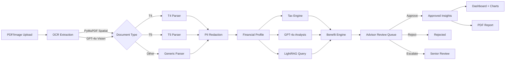
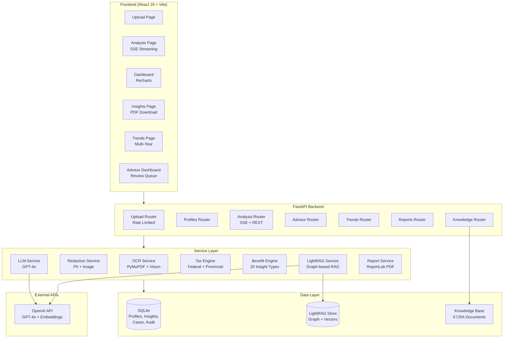
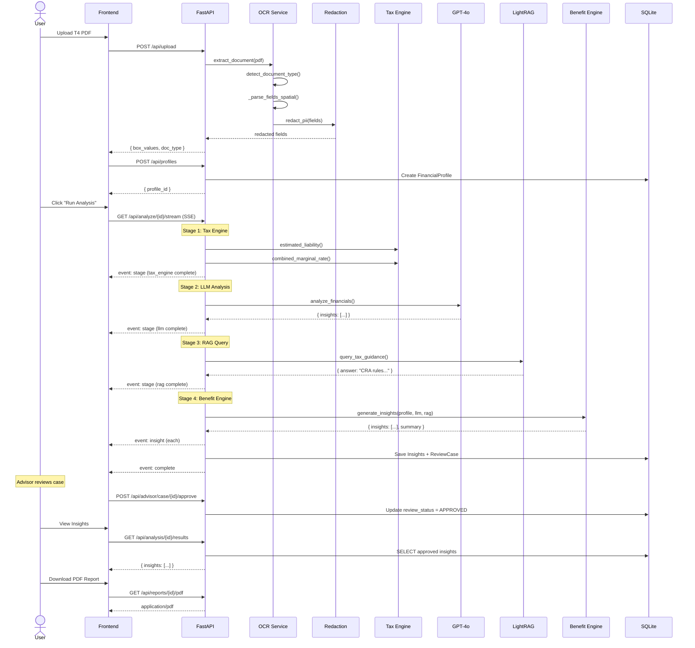
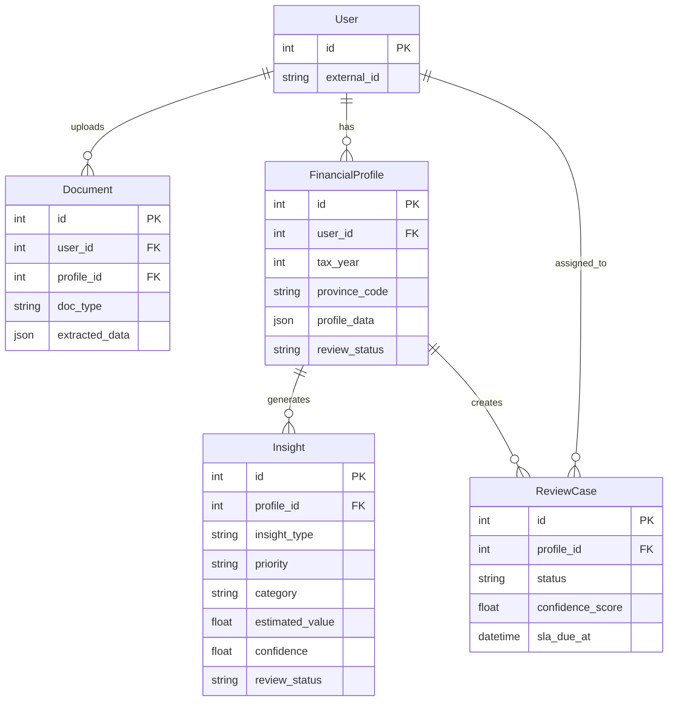

# Architecture — Wealthsimple AI Tax Analyzer

## Pipeline Flowchart

```mermaid
flowchart LR
    A[PDF/Image Upload] --> B[OCR Extraction]
    B --> |PyMuPDF Spatial| C{Document Type}
    B --> |GPT-4o Vision| C
    C --> |T4| D[T4 Parser]
    C --> |T5| E[T5 Parser]
    C --> |Other| F[Generic Parser]
    D & E & F --> G[PII Redaction]
    G --> H[Financial Profile]
    H --> I[Tax Engine]
    H --> J[GPT-4o Analysis]
    H --> K[LightRAG Query]
    I & J & K --> L[Benefit Engine]
    L --> M[Advisor Review Queue]
    M --> |Approve| N[Approved Insights]
    M --> |Reject| O[Rejected]
    M --> |Escalate| P[Senior Review]
    N --> Q[Dashboard + Charts]
    N --> R[PDF Report]
```

## Component Architecture

```mermaid
graph TB
    subgraph Frontend["Frontend (React 19 + Vite)"]
        Upload[Upload Page]
        Analysis[Analysis Page<br/>SSE Streaming]
        Dashboard[Dashboard<br/>Recharts]
        Insights[Insights Page<br/>PDF Download]
        Trends[Trends Page<br/>Multi-Year]
        Advisor[Advisor Dashboard<br/>Review Queue]
    end

    subgraph API["FastAPI Backend"]
        UploadR[Upload Router<br/>Rate Limited]
        ProfileR[Profiles Router]
        AnalysisR[Analysis Router<br/>SSE + REST]
        AdvisorR[Advisor Router]
        TrendsR[Trends Router]
        ReportsR[Reports Router]
        KnowledgeR[Knowledge Router]
    end

    subgraph Services["Service Layer"]
        OCR[OCR Service<br/>PyMuPDF + Vision]
        Redaction[Redaction Service<br/>PII + Image]
        LLM[LLM Service<br/>GPT-4o]
        TaxEngine[Tax Engine<br/>Federal + Provincial]
        BenefitEngine[Benefit Engine<br/>20 Insight Types]
        RAG[LightRAG Service<br/>Graph-based RAG]
        Report[Report Service<br/>ReportLab PDF]
    end

    subgraph Storage["Data Layer"]
        SQLite[(SQLite<br/>Profiles, Insights,<br/>Cases, Audit)]
        LightRAG[(LightRAG Store<br/>Graph + Vectors)]
        KB[Knowledge Base<br/>9 CRA Documents]
    end

    subgraph External["External APIs"]
        OpenAI[OpenAI API<br/>GPT-4o + Embeddings]
    end

    Frontend --> API
    API --> Services
    Services --> Storage
    LLM --> OpenAI
    RAG --> OpenAI
    RAG --> LightRAG
    KnowledgeR --> KB
```

## Sequence Diagram — Full Pipeline

```mermaid
sequenceDiagram
    actor User
    participant FE as Frontend
    participant API as FastAPI
    participant OCR as OCR Service
    participant Red as Redaction
    participant Tax as Tax Engine
    participant LLM as GPT-4o
    participant RAG as LightRAG
    participant BE as Benefit Engine
    participant DB as SQLite

    User->>FE: Upload T4 PDF
    FE->>API: POST /api/upload
    API->>OCR: extract_document(pdf)
    OCR->>OCR: detect_document_type()
    OCR->>OCR: _parse_fields_spatial()
    OCR->>Red: redact_pii(fields)
    Red-->>API: redacted fields
    API-->>FE: { box_values, doc_type }

    FE->>API: POST /api/profiles
    API->>DB: Create FinancialProfile
    API-->>FE: { profile_id }

    User->>FE: Click "Run Analysis"
    FE->>API: GET /api/analyze/{id}/stream (SSE)

    Note over API: Stage 1: Tax Engine
    API->>Tax: estimated_liability()
    API->>Tax: combined_marginal_rate()
    API-->>FE: event: stage (tax_engine complete)

    Note over API: Stage 2: LLM Analysis
    API->>LLM: analyze_financials()
    LLM-->>API: { insights: [...] }
    API-->>FE: event: stage (llm complete)

    Note over API: Stage 3: RAG Query
    API->>RAG: query_tax_guidance()
    RAG-->>API: { answer: "CRA rules..." }
    API-->>FE: event: stage (rag complete)

    Note over API: Stage 4: Benefit Engine
    API->>BE: generate_insights(profile, llm, rag)
    BE-->>API: { insights: [...], summary }
    API-->>FE: event: insight (each)
    API->>DB: Save Insights + ReviewCase
    API-->>FE: event: complete

    Note over User: Advisor reviews case
    FE->>API: POST /api/advisor/case/{id}/approve
    API->>DB: Update review_status = APPROVED

    User->>FE: View Insights
    FE->>API: GET /api/analysis/{id}/results
    API->>DB: SELECT approved insights
    API-->>FE: { insights: [...] }

    User->>FE: Download PDF Report
    FE->>API: GET /api/reports/{id}/pdf
    API-->>FE: application/pdf
```

## Data Model

```mermaid
erDiagram
    User ||--o{ Document : uploads
    User ||--o{ FinancialProfile : has
    FinancialProfile ||--o{ Insight : generates
    FinancialProfile ||--o{ ReviewCase : creates
    ReviewCase }o--|| User : assigned_to

    User {
        int id PK
        string external_id
    }

    Document {
        int id PK
        int user_id FK
        int profile_id FK
        string doc_type
        json extracted_data
    }

    FinancialProfile {
        int id PK
        int user_id FK
        int tax_year
        string province_code
        json profile_data
        string review_status
    }

    Insight {
        int id PK
        int profile_id FK
        string insight_type
        string priority
        string category
        float estimated_value
        float confidence
        string review_status
    }

    ReviewCase {
        int id PK
        int profile_id FK
        string status
        float confidence_score
        datetime sla_due_at
    }
```
